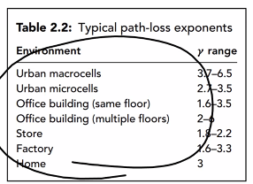

main components of wireless systems:

- transmitter
- receiver
- communication targets sharing information from one system to another
- form: `source --(message signal)--> transmitter --(transmitted signal)--> channel --(received signal)--> receiver --(estimate of message signal)--> destination`

how? with packets

- break data into buts and bytes and send those. or, send a collection of bits and bytes as packets.
  how do we send it?
- may not be able to send direct to destination
- utilize gateway nodes that know many other nodes and can calculate best paths
- received power Pᵣ ∝ 1/d²
- we will only worry about noise from the final base station to the destination
  - all other noise will be accounted for by each base station
- how do we know the best routes, so we're not using more forwarders than we need and effecting the signal?
  - we'll worry about it later

what if two nodes need to send packets at the same time?

- medium access control:
  - time/freq/code division multiple access
    - contention-free
    - FDMA is the most advanced one
  - carrier sense multiple access
    - contention-based
    - listen to medium before sending
    - only send when medium is silent
  - ethernet, wireless LAN use CSMA

wireless is everywhere, but there are challenges

heterogeneous = uses different means (e.g. freqs) to transmit

explosive growth of wireless systems in the last 20 years + proliferation of laptops, mobile phones ⇛ bright future for wireless networks

challenges of wireless communications

- single points of failure
- energy efficiency
- spectral efficiency
  - there are finite bandwidths
- unreliability
  - unpredictable and difficult
- mobility
  - wireless signals experience random fluctuations
  - network needs to locate users
  - devices are moving quickly which can effect signals
- security
  - airwaves are easy to intercept and look in on

noise:

recall the form of wireless communication:
`source --(message signal)--> transmitter --(transmitted signal)--> channel --(received signal)--> receiver --(estimate of message signal)--> destination`

- between the transmitter and receiver, the message will be encoded. it is decoded by the receiver.
- the channel introduces noise. we cannot avoid it.
  - external: interference from nearby channels, humans, natural...
  - internal: thermal noise,  random emission...
  - we measure the signal-to-noise power ratio
- if we're using sines and cosines to transmit, the noise might shift one into another or otherwise distort them
  - we can assume we're transmitting binary, where 1 = cos, 2 = sin
- instead, we decide that and incoming signal >0 = 1, and <0 = 0
  - if we know 0 or 1 is more common, we change that cutoff
- if we're transmitting more individual values, we split the frequencies into more different signals to accommodate it
  - 64 bits at a time ==> 64 different signals
  - you're more likely to lose some of it to noise, though
- t = original signal M + noise N

from the base station you may have either a circle or hexagon (or maybe square) with a radius of 2-10 km which is how far the signal can reach
- we can't crank up the power too high due to health concerns and it might interfere with other signals
	- also it required so much power
- in one cell area, all subscribers are served by the same base station (BS)
- when two base stations / cell areas are far enough away, they can use the same freqs without worry of interference
- if a user is sending within their own cell, the freqs might overlap and be interfered with
- we need a seamless transition in comms when moving from one cell to another
	- we don't really have it; ever had a phone call drop on the road?
- one unique code is assigned to each user by the BS, used to encode then decode the message
	- each user needs the codebook to be able to decode
- now we use many smaller BSs to cover th same area, using hexagonal cells so they tesselate

we will start with one cell area, one BS, and one receiver
- what is the received power Pr?
- what is the capacity C in bits/sec?
- in free space, c = wavelength \* freq f where c = speed of light 3x10^8
- if through materials other than air, v = wavelength \* freq f
- any EM wave has EM field lines E and B which are orthogonal
- imagine an open circuit, where electricity still flows. how?
	- maxwell says there is current transmitted only while our signal changes from off to on
- most real transmitting freqs fall into microwave freqs
	- 850 MHz, 1.9 GHz, 2.4 GHz, 5 GHz, 39 GHz
- SINR = signal-to-interference-noise ratio or SIR = signal-to-interference ratio
	- = Pr / (power of noise P_N + power of interference P_I)

different advantages:
- low freq..
	- passes obstacles easily, falls of at inverse-square
	- easy to generate
- hi freq...
	- prone to absorption by rain, reflected by obstacles
	- travels for hundreds of miles
	- need line of sight, narrowly focused
- infrared
	- cannot travel through obstacles

freq-domain concepts
- fundamental freq: all other freqs are multiples of it
- spectrum: range of freqs that a signal contains
- absolute bandwidth: width of the spectrum of a signal
- effective bandwidth: meant by just "bandwidth." narrow band of freqs the signal's energy is concentrated in
	- the space where maybe 90% of the signal is contained
	- if absolute bw is 400 MHz, we can make effective bw 160 MHz, where 90% of our signal is...
	- but maybe we still need to cut it down. we can lose another 2% and make it 150 MHz, which in this case is okay

three propagation modes
- ground wave
  - used for low-range; can hit the earth at long range
  - max distance is based on Tx signal power and freq it uses
- sky wave: 300 KHz - 30 MHz
  - uses ionosphere and earth as reflector
  - when a wave hits a reflector, it splits into a transmitted (T = 1+R) and reflected component (R)
    - how they split is based on the permittivity, permeability, and conductance of the material
    - this means the right waves can bounce off the ionosphere, where we maximize R and minimize T
    - in air, v = 1/√(Σₒμₒ) 
- space wave >30 MHz
  - line of sight necessary
  - max LOS distance dₘ = √(2Rhₜ) + √(2Rhᵣ)
    - if needed we put a repeater in the sky 
- frequency is the main difference
- propagation in free space with no obstacles is ideal

2.5 and 5g can be used by anybody

Tx sends power Pₜ over distance d to Rx. what is Pᵣ?

- path loss
  - Power = dBm drops off by an exponent
    - we measure the decrease in power over distance to find the path loss exponent
  - Pᵣ = GᵣGₜPₜ/((4πd/λ)²)
    - transmitted power Pₜ ***in Watts***
    - λ = c/f, for constant c = 3\*10⁸ and f in Hz
    - d = difference between heights of Tx and Rx antennae in meters
    - we assume Rx's channel gain Gᵣ = Tx's channel gain Gₜ = 1
- channel gain
  - isotropic antenna: equal power in all direction -> no antenna gain
  - directed/high gain antenna -> 
  - we use dB for these because it's log scaled
  - 10log(P mW/ 1 mW) dB = 10logP + 30 dBm
- example: fc = 900 MHz, r = 0.5 km = 500m, nondirectional antennas
  - Pₜ = 20W. find Pᵣ
    - Pᵣ = GᵣGₜPₜ/((4πd/λ)²) = Pₜ(λ/4πd)²
    - λ = c/f, we know f = 9*10⁸ and constant c = 3\*10⁸ so λ = 1/3
    - Pᵣ = Pₜ(λ/4πd)² = 20((1/3)/4π500)² = 5.5*10⁻⁸W
  - find a Pₜ such that Pᵣ = 1μW
    - 1μW = 1*10⁻⁶ = Pₜ(λ/4πd)² = Pₜ((1/3)/4π500)² etc.
    - Pₜ W = 10logPₜ dB

- isotropic antennae ⇛ G=1

- $P \propto 1/d^4$ 
- critical distance $d_c$ is where $P_r \propto P_tK/d^2$

- Two-ray model: • The cutoff distance above which free space model is not applicable can be determined using the following expression:
- Since smaller cells are more desirable — both to increase capacity and reduce transmit power — cell radii are typically much smaller than dc. 
The signals from proximal reflectors 
The signals from intermediate reflectors 
The signals from distant reflectors 
- Delay spread: When a signal propagates from a transmitter to a receiver, the signal suffers one or more reflections so that the path becomes indirect, and this forces radio signals to follow different paths. 

- when we send two rays, one will hit before the other. assuming they travel the same speed, we want to know the difference in their distances traveled. dividing by c lets us know the difference in their speeds.
- d is the positive difference in heights
- delay of a two-ray model = $(x+x'-l)/c$
  - delay by LOS ray 1 = $t_1 = l/c$
    - linear distance traveled by ray 1 = $l = \sqrt{(h_t-h_r)^2+d^2}$, where d is the ground distance (x component)
  - delay by bounced ray 2 = $t_2=(x+x')/c$
  - which means delay speed = $t_2-t_1 = (x+x')/c - l/c$
- $P_r = P_tG_tG_r(\frac{h_th_r}{d^2})^2$
- $d_c = 4\pi h_th_r/\lambda$
- this is the two-ray model; one gets bounced of the ground and the other is direct in line-of-sight.
- isotropic antenna = omni-directional antenna $\implies G_r=G_t=1$
- when $d < d_c$ we say we're in free space, and we'll use the one-ray model
  - which means $P_r = P_tG_RG_t(\frac{\lambda^2}{(4\pi d)^2})$
- when $d>d_c$ 
  - $P_r = P_t(\frac{h_th_r}{d^2})^2$
- $K db = 20log_{10}\frac{\lambda}{4\pi d_0}$
- K is a unitless constant that depends the antenna characteristics and the average channel attenuation
- $d_0$ is a reference distance for the antenna far field
- $\gamma$ is the path-loss exponent$
- common path-loss exponents
  - 
- $P_r \text{ dbm} = P_t\text{ dbm} + K \text{ db} - 10\gamma log_{10}[d/d_o]$
- signal-noise ratio $SNR = P_r/P_n$ where all units are in dB (i.e. log scale)

homework 1:
- $P_r = P_t K (d_0/d)^\gamma$
- dBm to watt: $\frac{10^{P_{(dBm)}/10}}{1000} = P_{(W)}$
- watt to dBm: $10log_{10}(1000*P_{(W)}) = P_{(dBm)} = 10log_{10}(P_{(W)})+30$
- dBm to dB: $P_{(dB)} = P_{(dBm)}+30$
- dB to dBm: $P_{(dBm)} = P_{(dB)}-30$
- Given $P$ in dB, $P_{(mW)} = 10^{P_{(dB)}/10}$
- Free-space path loss $P_L\ (dB) = 20log(d)-20log(\lambda)+20log(4\pi)$
  - for distance from Rx to Tx $d$ in m, wavelength $\lambda$ in m, and all logs are base-10
  - if you have freq $f$ in Hz then $P_L = 20log(d)+20log(f)+20log(\frac{4\pi}{c})$ with speed of light $c = 3*10^8$ m/s
  - path loss is in dB
- delay spread $\tau = \frac{x+x'-l}{c}$ in seconds
  - for speed of light $c = 3*10^8$ m/s
  - delay by LOS ray 1 = $t_1 = l/c$
    - distance traveled by LOS ray 1 $l = \sqrt{(h_t-h_r)^2+d^2}$, where d is the ground distance (x component) and for outside $h_t, h_r$
  - delay by reflected ray 2 = $t_2=(x+x')/c$
    - distance traveled by reflected ray 2 $x+x' = \sqrt{(h_t+h_r)^2+d^2}$ for inside $h_t, h_r$
  - all together, $\tau = \frac{\sqrt{(h_t+h_r)^2+d^2}-\sqrt{(h_t-h_r)^2+d^2}}{c}$
- in the two-ray model, $P_r = P_tG_tG_r(\frac{h_th_r}{d^2})^2$
  - given $P_t, P_r$ are in W and tower heights $h_t, h_R$ and distance

- the center tower can receive interference from either the left or right
- within each cell, $P_r = P_t\frac{G_tG_r\lambda^2}{(4\pi)^2}\frac{1}{d^2} \implies P_r = \frac{P_t K}{d^2}$ because $K = (\frac{\lambda}{4\pi})^2$
- each cell is a square with sides of 2 km
- we need $SIR (db) \geq 20 db \implies SIR \geq 100 \implies \frac{P_r}{P_I} \geq 100$
- interference between towers, given distance $d_2$ between them, is $P_I = \frac{P_tK}{d_2^2}$ 
- we want to minimize $P_r$ and maximize $P_I$ so $\frac{(P_r)_{min}}{(P_I)_{max}} \implies \frac{PK\frac{1}{d_{max}^2}}{2PK\frac{1}{d^2_{max}}}$
  - why 2? there is one interference signal coming from each other tower. ${P_I}_{left} + {P_I}_{right} = 2 (\frac{PK}{d^2_{min}})$
- we can make $\frac{{d_2^2}_{min}}{2{d_1^2}_{max}} \geq 100$
  - max distance from the center of a square is ${d_1}_{max} = \sqrt{2}$
- $\implies {d_2^2}_{min} \geq 400 \implies {d_2^2}_{min} \geq 20 km$
- i.e. physical distance between the center of each cell (i.e. the base station) and the transmitter
- part b:
  
  - calculate $d_{min}$ then add 1 to it

all of our models thus far have been deterministic (free-space, two-ray, simplified path loss)
- but we can't always have that
- multipath signals can be attenuated, delayed, phase-shifted, freq-shifted
- signals will arrive at different times
  - Rx has a time window, and it takes the average of all signals received in that time frame
- this introduced randomness
- the statistical characterization of the random multipath channel is based on its time-varying impulse response
- fluctuations happen due to a change in amplitude or phase, or multipath delays
- fading refers to time variation of received signal power caused by changes in the transmission medium or path(s).
  - propagation in multipath channels depends on the actual environment and LOS obstacles
- possible reactions to obstacles:
  - reflection: λ is smaller than object
  - diffraction: occurs at the edge of impenetrable body
  - scattering: λ comparable to size of object
- multipath fading:
  - unwanted effect of multipath propagation where time-delayed multipath signals arrive at different phases
  - weaken signal strength: phase addition/subtraction
  - intersymbol interference: one symbol interfered with subsequent signals
    - caused by delay spread
    - limits the max symbol rate of a digital multipath channel
- if the demodulator synchronizes to the LOS signal component, which has smallest delay $\tau_0$ then the delay spread is a constant $T_m = max_i[\tau_i - \tau_0]$
- ina  time-dispersive medium, transmission rate R for digital transmission is limited by delay spread $R < \frac{1}{2\tau_d}$
- demodulator deconstructs and retrieves the original signal
  - shifts the freqs from band pass

exercise
- LOS $t_0 =23 ns$, other routes $t_1 = 4.8 ns, t_2 = 67 ns$.
- delay spread is the total range of these times, so $\tau = t_2 - t_0 = 67-23 = 44 ns$

don't forget the randomness
- for random variables A, B we assume capture signal A, B's randomness
- $r_s(t) = A(t)cos(\omega t) + B(t)sun(\omega t)$
- $r_s(t) = C(t)sun(\omega t + f(t))$
  - where $C = \sqrt{A(t)^2 + B(t)^2}$ (Rayleigh distribution) and $f(t) = tan^{-1}(\frac{B(t)}{A(t)})$ (Uniform distribution)
    - Rayleigh is similar to gaussian distribution, but is dependent on σ: $\frac{z}{\sigma^2}exp[-\frac{z^2}{2\sigma^2}],\ z\geq 0$
    - $\sigma = \sqrt{P}$ where P is the average power measured
- phase shift and randomness are functions of time
- if z is Rayleigh distributed and its square is exponentially distributed
- $P_{Z^2}(x) = \frac{1}{\bar{P_r}}e^{-x/2\sigma^2} = \frac{1}{\bar{P_r}}e^{-x/2\sigma^2} ,\ x\geq 0;\ = \frac{1}{2\sigma^2}e^{-x/\bar{P_r}}$

exercise:
- consider a channel with Rayleigh fading and average received power of -10 dB. Find the outage probability that the received power is below -20dBm.
- $f = \frac{1}{\bar{P}}e^{-x/\bar{P}}$ when $\bar{P} = -10 db$
- $P(P_R < x_{th}) = \int_0^{x_{th}}f_x dx = \int_0^{x_{th}} \frac{1}{\bar{P}}e^{-x/\bar{P}} dx = \frac{1}{\bar{P}}([x^{-x/P}(\frac{-1}{P})]|_0^{x_{th}})$
- $x_{th} = -20 db \implies x_{th} = 0.01 W$
- $\bar{P} = -10 db \implies \bar{P} = 0.1 W$
- $P_e = 1-e^{-\frac{0.01}{0.1}}$
- probability of an outage $P_{out} = 1-e^{-P_{th}/\bar{P}}$ with all Powers in Watts
  - $P_{th}$ is the upper bound we want to check against, $\bar{P}$ is the 
- consider a channel with Rayleigh fading and average received power of 20 dBm. Find the outage probability that the received power is below 30dBm.
  - $P_{th} = 30 dBm = 1W;\ \bar{P} = 20dBm = 0.1 W$
  - $P_e = 1-e^{-\frac{1}{0.1}} \approx 1 = 100\%$
- suppose we have an application that limits power outage probability to .01 for the threshold $P_0 = -80 dBm$. for Rayleigh fading, what value of the average signal power is required?

wireless channel capcity
- maximum data rate that can be transmitted over a communication channel without error
- one Tx is sending multiple difference signals to multiple different Rx
- we just want to know the maximum rate we can send to each Rx (over their respective channels)
- $y[i] = x[i] + n[i]$
  - $x[n]$ is signal
  - $n[i]$ is noise
- Shannon-Hartley Theorem = Shannon Formula: $C = Blog_2(1+\frac{S}{N})$
  - C: channel capcity in bits/sec
    - $C \not{\propto} B$
  - B: bandwidth (Hz)
  - S: Signal power
  - N: Noise power
    - dependent on bandwidth
    - $P_N = N_0B$
      - $N_0$ is power spectral density
      - B is bandwidth
  - or perhaps $C = Blog_2(1+SNR)$
    - where $SNR = \frac{P_R}{P_N} = \frac{P_R}{N_0B}$
  - recall that the log scale flattens out after a certain threshold
    - doubling power does not double capacity
  - $SNR_{linear} = \frac{P_{signal}}{P_{noise}}$
  - $SNR_{dB} = 10log_{10}\frac{S}{N}$
- with low SNR, we need to increase B for best increase of channel capacity (because B is in linear scale)
- with high SNR, C increases slowly (due to SNR's log scaling)
- fading occurs due to Rayleigh fading
  - capacity becomes a random variable
  - Ergodic capacity (average/expected value) $\mathbb{E}$ is considered for fast fading, so channel capacity $C = \mathbb{E}(Blog_2(1+\gamma))$
    - $\gamma$ is SNR here
  - $y[i] = h[i]x[i] + n[i]$ for fading coefficient $h[i]$
      - h changes between intervals of time; so it can be considered a constant during certain intervals, then it changes its value at the next one.
      - this gives different Cs for each interval
      - this isn't exactly realistic but we can use it
- block fading
  - a channel model where the fading is constant over a block of transmitted symbols but it changes independently from one block to another
    - static within a block
    - random across a block
    - useful for modeling *slow*-moving users or *slowly*-varying environments
  - now we need to call $y_i = h_bx_i + n_i$ for $i \in \text{block } b$
    - $y_i$ is the ith received symbol
    - $x_i$ is the ith transmitted symbol
    - $h_b$ is the fading coefficient for block b
    - $n_i$ is the noise on the ith symbol
  - so $C_i + Blog_2(1+\gamma_i)$
  - we find $C_i$ for all blocks
  - to approximate $C$ we get $C_{avg} = $
    - we can't take a regular average
    - instead $C_{avg} = p_1C_1 + p_2C_2 + \dots + p_NC_N$
    - where $p$ is the percent of time for which $C=C_i$
- we can know capacity if CSI, channel state information (all $h[i]$ and $P_i$) are known by receiver
- we cannot optimize or change power
- ergodic capacity: average over the distribution of $\gamma = SNR$
- only receiver knows instantaneous SNR, so data rate Txed is constant
  - in this case our optimization: if Tx knows all CSI, we can send more power when h is high and less when it's low
- exercise 1
  - consider a flat-fading channel with iid channel fading coefficient h[i] which can take three possible values: $g_1 = 0.1\ (p_1 =0.1), g_2 = 0.7\ (p_2 = 0.5), g_3 = 0.95\ (p_3 = 0.4)$. $P_T = 10 mW = 10\times 10^-3 W, N_0 = 10^{-9} W/Hz, B=30kHz=30\times 10^3 Hz$
    - $y[i] = h[i]x[i] + n[i]$ where $g[i] = (h[i])^2$
  - find Shannon capacity when Rx knows instantaneous g[i] but not Tx.
  - $\gamma_1 = \frac{P_{r_1}}{P_N} = \frac{g_1P_t}{N_0 B} = \frac{0.1 * 10\times 10^{-3}}{10^{-9}*30\times 10^3} = 66.7$
  - $C_1 = Blog_2(1+\gamma_1) = 30\times 10^3 log_2(1+66.7) = 182.4 Kbps$
    - note Kbps = kilobits/sec
  - calculate the same for the other two blocks
  - $C_{avg} = p_1C_1 + p_2C_2 + p_3C_3 = whatever$
- $C_{avg} \leq \mathbb{E}(Blog_2(1+\gamma)) = Blog_2(1+\bar{\gamma})$
  > the Shannon capacity of a fading channel with receiver CSI is always less than the Shannon capacity of an AWGN channel with the same average SNR
- exercise 2
  - consider a flat-fading channel with iid channel fading coefficient h[i] which can take three possible values: $g_1 = 0.2\ (p_1 =0.6), g_2 = 0.7\ (p_2 = 0.3), g_3 = 0.95\ (p_3 = 0.1)$. $P_T = 10 mW = 10\times 10^{-3} W, N_0 = 10^{-9} W/Hz, B=100kHz=100\times 10^3 Hz$.
    - find Shannon capacity when Rx knows instantaneous g[i] but not Tx.
      - $\gamma_1 = g_1\frac{P_t}{N_0 B} = 0.2\frac{10*10^{-3}}{10^{-9}*100*10^3} = 20$
      - $\gamma_2 = 0.7\frac{10*10^{-3}}{10^{-9}*100*10^3} = 70$
      - $\gamma_3 = 0.95\frac{10*10^{-3}}{10^{-9}*100*10^3} = 95$
      - $C_1 = (100\times 10^3)log_2(1+20) = 4.3923e5 \approx 439 Kbps$
      - $C_2 = (100\times 10^3)log_2(1+70) = 6.1497e5 \approx 615 Kbps$
      - $C_3 = (100\times 10^3)log_2(1+95) = 6.5850e5 \approx 658 Kbps$
      - $C_{avg} = 0.6(439) + 0.3(615) + 0.1(658) = 513.7 Kbps$
    - compare with Shannon capacity of an AWGN channel with the same average SNR.
      - $\gamma_{avg} = 0.6(20) + 0.3(70) + 0.1(95) = 42.5$
      - $C = 100\times 10^3*log_2(1+42.5) = 5.443 Kbps$
      - this C is our upper boundary for how good C can get
      - in research we'd use $\mathbb{E}[\gamma]$ instead of exact $\gamma$ because it's hard or impossible to calculate

- what if i started organizing these notes in a meaningful way (impossible)
# 4/7
- $C = \sum_i Blog_2(1+\gamma_i)p(\gamma_i)$
> transmitter can adapt its transmission strategy relative to the channel state information, and it will not send bits unless they can be decoded correctly.
- $C = \sum P_i C_i$ is true $\forall i$
- if there are multiple channel values their probabilities $P_1 : P_5$ should add up to 1
- $C_i = Blog_2(1+SNR)$
- $SNR_i = g_iP_t/P_N$ 
- if Rx knows CSI (channel state information), it can optimize the transmit power
- if only TX knows, it will send data at a constant rate or power
- optimal power adaption that maximizes the capacity:
  - $\gamma \geq \gamma_0 \Rrightarrow \frac{1}{\gamma_0} - \frac{1}{\gamma}$
  - $\gamma < \gamma_0 \Rrightarrow 0$
- $\sum_{\gamma_i \geq \gamma_0} \frac{1}{\gamma_0} - \frac{1}{\gamma_i}p(\gamma_i)=1$
- imagine the signal levels per subchannel are below sea level. we can fill up the space between the bars and sea level (required power) by adding more water (assigned power). if they are above sea level, we allocate no additional power.
- general expression $C = \sum_i p(\gamma_i)Blog_2(1+\gamma_i)$
- $C_{average} = \sum_i Blog_2\frac{\gamma_i}{\gamma_0}p(\gamma_i)$
- $\sum_i (\frac{1}{\gamma_0} - \frac{1}{\gamma_i})p_i =1$
  - if we know all edge/failing cases then we know the minimum threshold

exercise:
- Case 1 [Rx]:
  - $g_1=0.15; p_1=0.6; g_2; 0.64; p_2=0.4; P_t=5W; N_0=10^{-7}W/Hz; B=1MHz$
  - $SNR_1 = \gamma_1 = g_1P_t/P_n = 7.5$
  - $SNR_2 = \gamma_2 = g_2P_t/P_n = 32$
  - where $P_N = N_0B$
  - $C = B[p_1log_2(1+SNR_1) + p_2log_2(1+SNR_2)]$
    - $= 10^6(0.6log_2(1+7.5)+0.4log_2(1+32)) = 3.87e6 bps = 3.87Mbps$
  - check that $(\frac{1}{\gamma_0} - \frac{1}{\gamma_i})p_1 + (\frac{1}{\gamma_0}-\frac{1}{\gamma_i})p_2 = 1$
  - we know $\gamma_0 = 9 \implies \gamma_0 < \gamma_2$
- Case 2 [Rx & Tx]
  - we may assume $\gamma_0 < \gamma_1$ and $\gamma_0 < \gamma_2$
    - thus $\frac{1}{\gamma_0}=1+\frac{p_1}{\gamma_1}+\frac{p_2}{\gamma_2}$
    - $=1+\frac{0.6}{7.5}+\frac{0.4}{32} \implies \gamma_0 = 0.915$
  - $C_{avg} = B[p_2log_2\frac{\gamma_2}{\gamma_0} + p_1log_2\frac{\gamma_1}{\gamma_0}]$
    - $= 10^6[0.6log_2\frac{32}{0.915} + 0.4log_2\frac{7.5}{0.915}] = 4.59e6 bps$
  - if $p_1, p_2$ change, so will γ
- if one of $\gamma_0 < \gamma_1$ or $\gamma_0 < \gamma_2$ fail, we will remove that channel from our calculations and it will be considered silent ($P_t = 0$)

exercise 2:

- zero outage capacity: maximum data rate that can be maintained in all non-outage channel states
  - > the Tx uses the CSI to maintain a constant rx power; i.e. inverts the channel fading
- zero-outage capacity $C_{z-0} =Blog_2[1+\sigma]=Blog_2[1+\frac{1}{\mathbb{E}[1/\gamma]}]$
- $\mathbb{E}[1/\gamma] = \sum_i p_i/\gamma_i$
- based on exercise 2:
  - $\mathbb{E}[1/\gamma] = 0.5/0.1 + 0.3/1 + 0.2/10 = 5.32$
- outage capacity and truncated channel inversion
  - outage capacity: max data rate that can be maintained in all non-outage channel states multiplies by the probability of non-outage
  - suspending transmission in particularly bad fading state results a higher constant data rate in other states
- outage capacity with a truncated channel inversion policy:
- if we use the same values as ex. 2 and cutoff value $\gamma_0 = 0.7$, $\gamma_1 < \gamma_0$ but the other 2 states pass. thus we only consider $\gamma_2, \gamma_3$
- $C(P_{out}) = Blog_2(1+\frac{1}{\mathbb{E}_{\gamma_0}[1/\gamma_0]})p(\gamma \geq \gamma_0)$
  - $p(\gamma \geq \gamma_0)$ is the probability of non-outage, in ex. 2 it's $p_2+p_3$ since $\gamma_1 < \gamma_0$ so we excluded it
  - here $C = 10^5[log_2(1+\frac{1}{\mathbb{E}[1/\gamma] = 0.32})]*0.5 \approx 0.102Mbps =102 Kbps$
- this is much simpler than the previous strategy because we start with $\gamma_0$ instead of calculating it and excluding channels over and over
- Capacity of Frequency-Selective Channels
  - consider a time-invariant channel with freq response H(f) known to both Tx and Rx
  - H(f) is block-fading, so that freq is divided into subchannels of bandwidth B over each subchannel
- we need to consider multiple transmitters, and how they share the max capacity we calculated before

# 4/21
## Medium Access Control (MAC)
- MAC has an impact on reliability, throughput, and energy efficiency
- defined by a rate user rather than a single number
- data rate is in bps, energy efficiency EE is in bpJ.
- improving data rate (by using more power) decreases energy efficiency
- $EE = \frac{}{P_t+P_loss+P_?}$
- we maximize R by maximizing $log(1+SNR)$
- we want to maximize EE, so we need a rate $R \geq$ threshold $R_0$
- or (which we won't do) maximize R by $EE \geq EE_{threshold}$
- contention: shares the broadcast medium, carrier sensing mechanism is applies
- there is contention-free and contention-based MCA
  - in contention free, it is centralized and under-utilization can occur
- contention-free protocols can be fixed or dynamic assignment
  - fixed includes FDMA, TDMA, CDMA, SDMA
  - in fixed, you cannot reassign a device's spot to another if it's not needed, so it's inefficient
- contention-based includes Aloha, CSMA, MACA, MACAW
## Time Division Multiple Access (TDMA)
- 3d: power, time, freq
- multiple nodes occupy the entire bandwidth
- simple to employ
- time synchronized; each user gets time, but no user gets the entire time
  - prefers centralized architecture
- static # of nodes
  - cannot accommodate more customers
- users cannot share time
- $R_i = \tau_i Blog_2(1+\frac{g_iP_i}{N_i})$
  - where $\tau_i$ is time allocated for user i, $\tau_n = T_n/T$
  - the entire factor $Blog_2(1+\frac{g_iP_i}{N_i})$ is constant
  - $N_i = Bn_i$
  - $g_i=P_i/N_i$ is channel gain for the link between user i and Rx
- $C=\sum_{i=1}^N R_i$
- $R \propto T_i$
### exercise
- assume no fading
- $Y=X+N$; $R=Blog(1+P/P_N)$
- $P_1 = 10mW, P_2 = 20mW$
- B=10kHz
- $R_{sum} = R_1+R_2$
- $R_1=B \tau_1 log_2(1+SNR_1)$
- $R_2=B \tau_2 log_2(1+SNR_2)$
- one user is able to send information at a time due to time division
- given $\tau_1 = 0.3, \tau_1+\tau_2=1$
- because we only have 2 channels, $\tau_2 = 1-\tau_1 = 0.7$
- $SNR_1 = P_1/P_N = (10e-3)/(N_1B)=(10e-3)/(1e-9*10e3)=10e3$
- $SNR_2 = P_2/N_2B = (20e-3)/(10^-8 * 10e3)=2e3$
- $R_1 = 10e3[0.3log_2(1+10e3)]\approx 39.86e3bps$
- $R_2 = 10e3[0.7log_2(1+2e3)]\approx 76.76e3bps$
- $R_{sum}= R_1+R_2 = 116.62 kbps$
- is this the maximum?
- maximize $R_1+R_2$ given $\tau_1 + \tau_2 \leq 1$
### exercise
- $R_1 = 0.3Mbps; R_2=?; P_t = 20mW; N_1=10^{-9}W/Hz; N_2=10^{-8}W/Hz; B=0.1MHz$
- $R_1 = B\tau_1log_2(1+SNR_1)$ where $SNR = P_1/N_1B = 20e-3/(1e-9*0.1e6)= 200$
- $R_1 = 0.3e6 = (0.1e6)\tau_1log_2(1+200) \implies \tau_1 \approx 0.39$
- $\tau_2 = 1-\tau_1 = 0.61$
- $SNR_2 = P_2/N_2B = 20e-3/(1e-8*.1e6) \approx 2$
- sometimes we will get an optimization solution where we make one user silent; which is correct, but not what we want to do
- we can also only look for solutions where x+y *=* 1 instead of $x+y\leq 1$, so we're maximizing our usage of allocated resources
## Frequency Division Multiple Access (FDMA)
- let user communicate ll the time, but restrict freq instead
- $R_i = B_ilog_2(1+\frac{g_iP_i}{N_iB_i})$
  - no τ; the bandwidth now changes per user
  - thus only the factor $log_2(1+\frac{g_iP_i}{N_i})$ is constant
- noise is dependent upon bandwidth; less bandwidth means less possible noise
### exercise
- $P_t = 20mW; N_1 = 1e-9 W/Hz; N_2 = 1e-8W/Hz; R_1 = 0.1Mbps; B_{total}=0.1MHz; R_2=?$, assuming no fading ($g=0$)
- first: assume $B_1=B_2 = (0.1/2)*10^6$
- $R_1 = B_1log_2(1+(P_1/N_1B_1)) = ((0.1/2)*10^6)log_2[1+(P_1/(1e-9)((0.1/2)*10^6))]\implies P_1 = 3.15*10^{-3}$
- $P_1+P_2=20mW \implies P_2 = 20-3.15 = 16.85 mW$
- $R_2 = B_2log_2[1+P_2/N_2B_2] = (0.1/2)*10^6log_2[1+\frac{16.85e-3}{10^{-9}(0.1/2)*10^6}] \approx 255.9 kbps$
- compare this to the exercise with TDMA which had the same numbers but a smaller $R_2$.

now do it again except $B_1 = 0.25B; B_2 = 0.75B$
- $R_1 = 0.3e6 = (0.25*0.1e6)log_2(1+\frac{P_1}{1e-9(.25*0.1e6)}) \implies P_1 = 0.102375$
- given $P_1+P_2=20mW \implies P_2 = (20e-3)-0.102375 = whargever$

# 4/28
- successive interference cancellation (SIC):
  - the receiver receives and decodes the data of user 2, then it can reconstruct user 2's signal and subtract it from the aggregate received signal. then it can decode the data of user 1. since we can now subtract both signals and get just the background gaussian noise, user 1 can transmit its single-user bound.
- ${C_1}_{max} = Blog_2 (1+\frac{P_n}{P_N+I_1})$
- for two users, $I_1 = P_2$; $I_2= P_1$
- for three users, $I_1 = P_2+P_3; I_2 = I_1 + I_2; I_3 = P_1+P_2$
- etc.
- used when many users are concurrently sending a signal to the same receiver
- to max TDMA, we have to silence user 1 or 2.
- the max of FDMA is lower than the max of SIC
- SIC's best case data rate is $R= log(1+\frac{P_2}{N_0})$, its worst case is $R = log(1+\frac{P_2}{P_1 + N_0})$
- whichever user SIC decodes first gets the best case, the other gets the worst case
  - order denoted as (1,2) for user 1 then user 2
- we can do time division on SIC given percent of time $tau_1$ we spend prioritizing each user
  - $\tau_1 {C_1}_{max} +(1-\tau_1){C_2}_{max}$ 
- with 2 users, user 2 has no interference ⇔ user 1 has interference
- $P_N = N_{this}B$
- total transmit power $P_t = P_1 + P_2$
## exercise:
consider a MAC channel in AWGN with transmit power $P_1 = 200mw$ and $P_2= 100mW$ and channel gains $g_1=.8$ for user 1 and $g_2 = .1$ for user 2. assume the receiver noise has $N_0 = 10^{-11} W/Hz$ and $B=10MHz$. find the rate that user 2 can achieve if user 1 requires a rate of
- $R_1 = 35 Mbps$
  - $R_{max} = Blog_2(1+\frac{g_1P_1}{P_N}) =10^7log_2(1+\frac{0.8*200*10^{-3}}{10^{-11}*10^7})= 106.4Mbps$
  - $R_{min} = Blog_2(1+\frac{g_1P_1}{P_N+g_2P_2})= Blog_2(1+\frac{0.8*200*10^{-3}}{10^{-4}+0.1*100*10^{-3}}) =  40.9Mbps$
  - $R_1(=35Mbps)<{R_1}_{min}(=40.9Mbps) \implies R_2={R_2}_{max}$
- $R_1 = 115 Mbps$
  - $R_1>R_{max}$. this case is impossible. thus $R_1=0, R_2=0$.
- $R_1 = 55 Mbps$
  - ${R_1}_{min}<R_1<{R_1}_{max}$, thus we use time-sharing
  - $R_1 = \tau_1 R_1^{max} + (1-\tau_1)R_1^{min}$
    - recall that in $R_1^{max}$, we assume decode order (2,1), and order (1,2) for $R_1^{min}$
  - $55 = \tau_1(106.4) + (1-\tau_1)40.9 \implies \tau_1 = 0.215$
  - we still need $R_2$
    - $R_2^{min} = Blog(1+\frac{g_2P_2}{P_N+g_1P_1}) = 10^7log(1+\frac{0.1*100*10^{-3}}{10^{-4}+0.8*100*10^{-3}})=0.875 Mbps$
  - $R_2= (0.215)(0.875)+(1-0.215)(66.58) = 52.45 Mbps$

## Contention-Based/Random Access Protocols
### Pure ALOHA
- user transmits data packets as soon as they are formed
- simultaneous transmissions cause packet loss
  - they might send at the same time or user 2 starts sending before user 1 is done sending 
- random wait time before retransmission
- pure ALOHA has throughput $T=Te^{-2L}$ with max of $18.4\%$ of what it would be with only one user, which makes it very inefficient
### Slotted ALOHA
- time is slotted and transmission times are synchronized
- throughput $T=Te^{-L}$ with max being $37\%$ of what it would be with only one user, which is STILL quite inefficient.
### Carrier Sense Multiple Access
- ensures fewer collisions, performs better under heavy load
- users check if Rx is busy or idle before sending data packets
- collision due to propagation delay (time needed for a signal to propagate from one end of the medium to the other)
### 1-persistent CSMA
- node senses the channel/wireless medium
  - free: transmit immediately (probability 1)
  - busy: keep sensing until channel is free
- highest chance of collision (false detection)
- performance depends on propagation delay
- no problem if only 1 user
- when multiple users, multiple users sending at the same time will all send their packets at the same exact time (whenever the Rx is free)
### non-persistent CSMA
- node senses the wireless channel
  - idle: transmit
  - busy: wait for random period (not continuously) then sense again
    - the random backoff avoids multiple users simultaneously transmitting as soon as the channel of free, minimizing collisions.
- capacity is wasted because the medium generally remains idle even if $\geq1$ stations are waiting to transmit
  - i.e. a random amount of time is usually wasted because nobody starts transmitting again instantly when Rx goes idle again
### p-persistent CSMA
- node senses the medium
  - idle: transmit with probability p. if not transmitted (with probability q = 1-p), wait some time before checking again.
  - busy: check persistently until Rx is idle
- will not waste time, has least chance so far of packet collision
### hidden and exposed terminal problems
- collision of packets at a receiving node due to the simultaneous transmission of those nodes that are not within the direct transmission range of the sender, but are within the transmission range of the receiver.
- hidden terminal problem: not all users can contact each other, but they can all contact the Rx.
- exposed terminal problem: users can contact each other, but they are using different Rx that cannot reach each other.
- A Mac protocol should grant channel access to nodes in such a manner that collisions are minimized.
### Multiple Access Collision Avoidance (MACA) Protocol
- users must send request-to-send and Rx returns clear-to-send if clear (and only to that Tx), only then can Tx send the data
- both RTS and CTS signal are sent to everyone, and thus other Txs know that the Rx will be busy
- when Rx finished receiving, is sends acknowledgment signal ACK, now everyone knows that it is free again
- 

## Exam info
- 1: conceptual
  - multipass fading
  - small-scale fading
  - channel inversion
  - TDMA vs FDMA, differences?
  - contention-based vs contention-free transmission, differences in general?
- 2: FRQ
  - 1 like today, CDMA
  - same problem but using TDMA
- 3: FRQ
  - shannon capacity
  - knowing that channel state information, find channel capacity and zero-outage capacity
